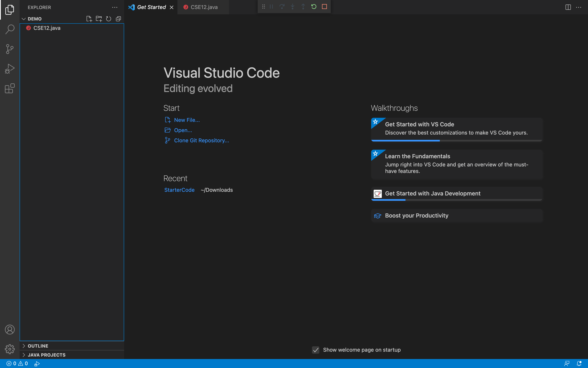
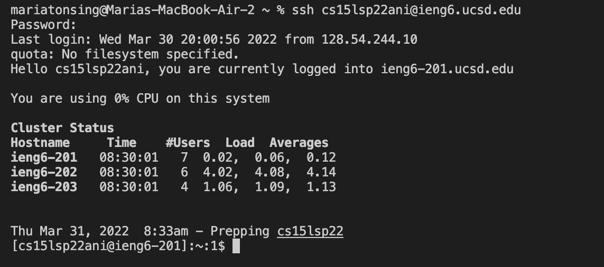
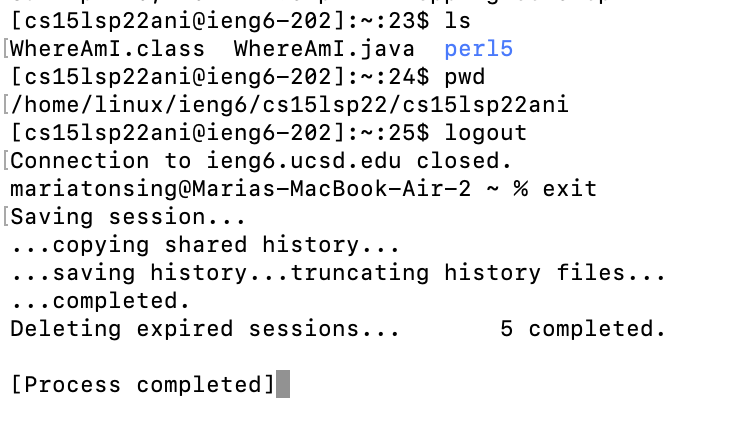
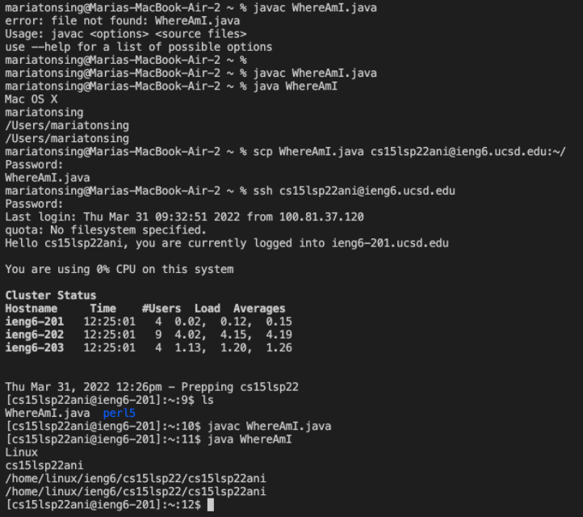
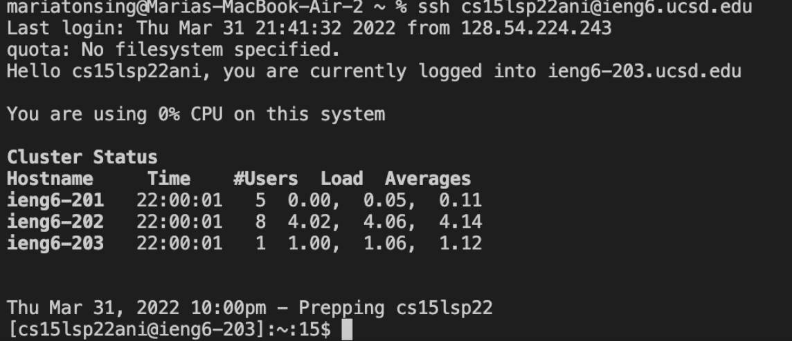
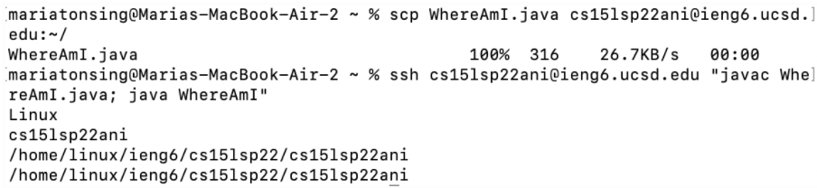

# Lab Report 1:How to log into a course specific account on *ieng6*

## Instaling VScode:
First we will show you how to download VisualStudio Code. On your web browser you will need to open the Visual Studio website which can be done by pressing the following word, [Visual Studio Code](https://code.visualstudio.com/). Once on the website you can choose the download that is best fit for the type of computer you have. Once you have chosen the download that best fit your type of computer it will prompt you with instructions on how to download and install visual studio code. Once you have completed their instruction you would have completed the first step, **installing VScode**. 
**Here is an image that you should see once you open the application VScode.**

## Remotely Connecting:
Now we can move onto the second step which is being able to remotely connect to a computer that is in the CSE basement. Before we begin you will first need to be able to know your course-specific account for CSE15L which can be done by pressing the following word [course-specific account](https://sdacs.ucsd.edu/~icc/index.php). Now we will access the terminal which can be done by having your VSCODE app open and going to the top bar of your computer and pressing **Terminal** and then selecting **New Terminal**. Once the terminal has been opened you can type in the terminal, **ssh cs15lsp22mm@ieng6.ucsd.edu**, where mm is a placeholder for your own letters that are in your course-specific account. If this is your first time remotely connecting you will receive a messages starting with  The authenticity of host ‘ieng6.ucsd.edu’ (128.54.70.227)’ can’t be established with its final message being Are you sure you want to continue connecting (yes/no/fingerprint])? You must enter yes and once you do this you will be prompted to put in your password. Keep in mind you will not be able to see what you typed in for privacy reasons. Once you have completed these steps you successfully were able to **remotely connect** to a computer located in the CSE basement congrats! 

**Since I do not have an image of my first time remotely connecting here is an image of what it would look like after your second time remotely connecting.**

## Trying Some Commands:
Now we will run some commands, as you may know there are several commands that can be used in a terminal, commands including, but not limited to,  pwd, cd, ls. To clarify after following step 2 the commands you are running are not running on your computer but in fact on the computer in the CSE basement also known as the server. To describe a few commands the command **ls** will show a list of the files that are in the current directory you are in. In addition the command **pwd** will print the current directory which is useful to know which directory you are in as well as what is in the directory. Once in the server you may want to know how to sign out and go back to your own computer you can do so by entering  CTRl -D and then enter the command *exit*. These are just a few commands that you can use to try **running some commands**. 

**Here is an image of me using the ls and pwd command as well as me exiting the server.**

## Moving Files with *scp*:
Now we will learn how to move files by using **scp**. To clarify we will be using the scp files on our server thus you should make sure you ran the previous step of how to exit ieng6, the server. In order to move a file we must create a file called WhereAmI.java where you can input WhereAmI with the name you want your file to be called. To create a new file on the menu bar on the top of your computer press file then new file. After creating the new file and putting any code you desire within it you are ready to move the file. In the terminal you should enter, **scp WhereAmI.java cs15lsp22mm@ieng6.ucsd.edu**. Where you will then be promoted to enter your password and should enter your password. Next you will use step 2 again to remotely connect to the computer in the cse basement. Once logged on you can enter the command **ls** that was referenced in step 4. After this step we have shown that our file WhereAmI.java is in fact in our home directory. Thus we have been able to successfully **move the file using scp**
**Here is an image of me moving the file WhereAmI, beware that my file has code that may be different from yours which is why the output may not be identical.**

## Setting an SSH key:
Now we will set an **SSH Key** which is helpful in not having you to type your password every time you want to re-login to the server. Therefore to start the process you will need to make sure you are in your own computer thus follow the command in step 3 to sign out of the computer in the cse basement if you were still logged into the computer in the cse basement. Now you will enter **ssh-keygen** to start the process. It will prompt you with the file in which to save the key, after this prompt you should enter what was in parenthesis before it meaning you should copy and paste **/Users/<user-name>/.ssh/id_rs** which of course will have your username within the angle brackets. After this has been inputted you will be asked to enter a passphrase that you do not have to so just press enter again. After pressing enter twice since it ask you twice to enter a passphrase you would have been able to successfully save your identification and public key in the file /Users/<user-name>/.ssh/id_rs. Next we will copy our public key to our .ssh directory that’s in the cse basement computer. We do this by first entering ssh cs15lsp22mm@ieng6.ucsd.edu
then enter your password which is similar to step three we have just logged onto the server. Now to exit and go back to your own computer you will enter **mkdir .ssh** . Now to save your username and password you will enter **scp /Users/<user-name>/.ssh/id_rsa.pub cs15lsp22mm@ieng6.ucsd.edu:~/.ssh/authorized__keys**. To clarify what we just did, we just created two files one called public key that which you have copied to a specific place in your own computer and the other called private key where you also copy to a particular place in the computer in the cse basement. This process then allows us to use the ssh command to use these files we just made to be place in for you password so you no longer have to type in your password. In order to check if we did it correctly we can do it by using ssh again to login like from step 3. 
**The image below will show how the last step looks once you successfully set an ssh key.**

## Optimizing Remote Running:
Now we will teach you how to optimize remote running. An example of optimizing remote running is being able to create a local edit to the file you created in step 4 and being able to copy it to the computer in the cse basement and be able to run it. Why are we calling it optimize remote running? It is because there are several helpful methods to optimize your time when in the terminal. These helpful methods include adding in parenthesis a command to the end of a ssh command such as "ls”. In addition one can also be more time efficient when remote running by using semicolons which help run more than one commands at the same line. Furthermore one can also utilize the up arrow on your keyboard in order to call the last command that was run. Putting this to action we will use the example that was stated earlier. First we will make an edit to our file created in step four then will run the command **cp WhereAmI.java OtherMain.java;javac OtherMain.java; java WhereAmI**. This one line does multiple jobs such as first copying WhereAmI.java OtherMain.java and then reading the WhereAmI.java file then running OtherMain. We will now use the other method we have provided by logging into the cse computer using ssh and then using ls to see if it has in fact been updated at the same time by entering **ssh cs15lsp22ani@ieng6.ucsd.edu “ls”**.  
**Here is an image of succesfully using the optimizing **remote running** to copying a file created in you computer and into the computer in the cse basement**.

