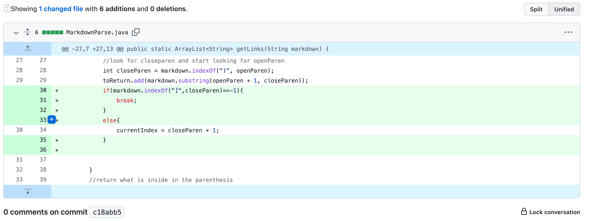
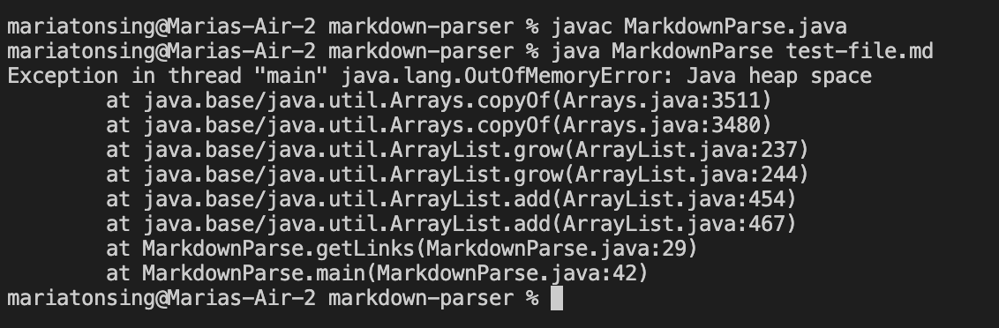
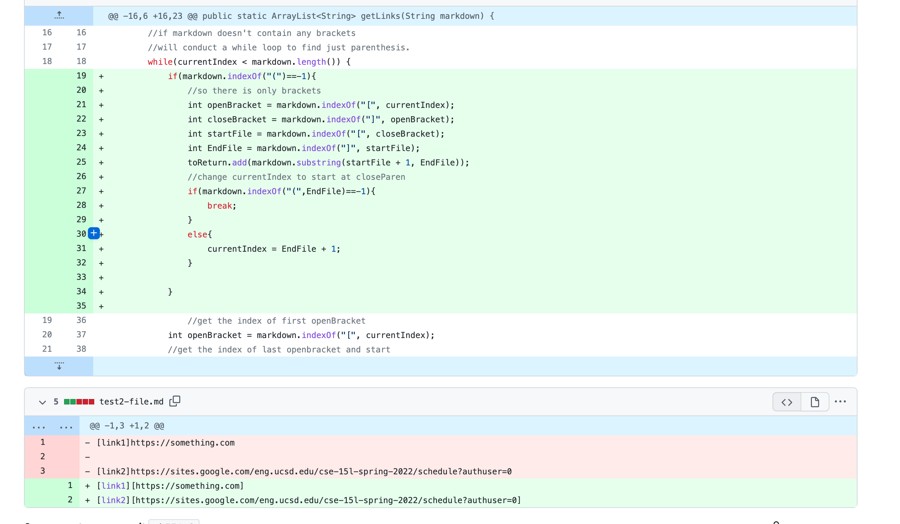
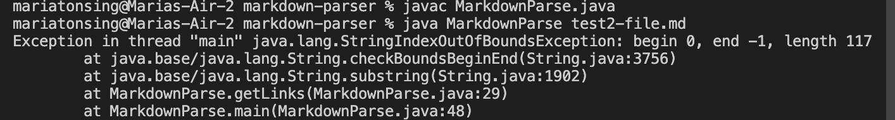
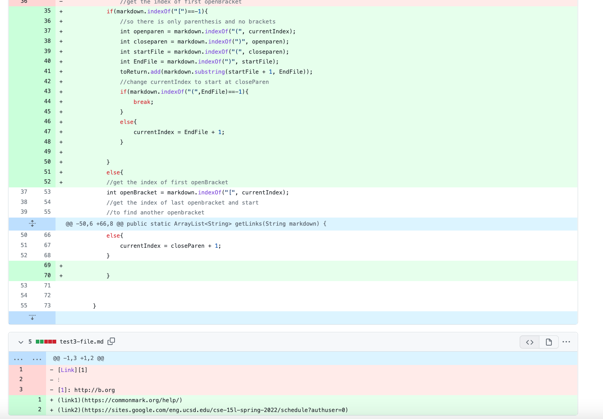
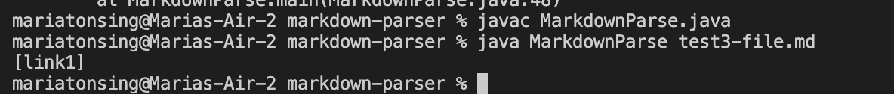

# Lab Report 1:How to fix a bug
Now we will show you to fix bugs when the output is 
not what you desire. 
Our goal in our code is be given file names and the link name and be able to print only link and not the file name. While the accurate way to print a link is by putting the name of the link you want to show in brackets and have the following be parenthesis with the link it's possible for there to be wrong output.

## When we have several blank lines after the file names.
* This is a screenshot of the code i was able to do to fix the bug.

* link to the test file that made me prompt change
[File that which failed first](https://github.com/mtonsing/markdown-parser/blob/main/test-file.md)
* This is the output for when we have more than one blank line.

* relationship between bug, the symptom and failing output.
The relationship is... 
## Trying a file that uses [] and not () .
* screenshot of code differ

* link to the test file that made me prompt change
[File that which failed first](https://github.com/mtonsing/markdown-parser/blob/main/test2-file.md)
* This is output for when use only [] and no ()

* relationship between bug, the symptom and failing output. 
## A file that uses () and not [].
* screenshot of code differ

* link to the test file that made me prompt change
[File that which failed first](https://github.com/mtonsing/markdown-parser/blob/main/test3-file.md)
* This is the output for when use only () and no []

* relationship between bug, the symptom and failing output. 

