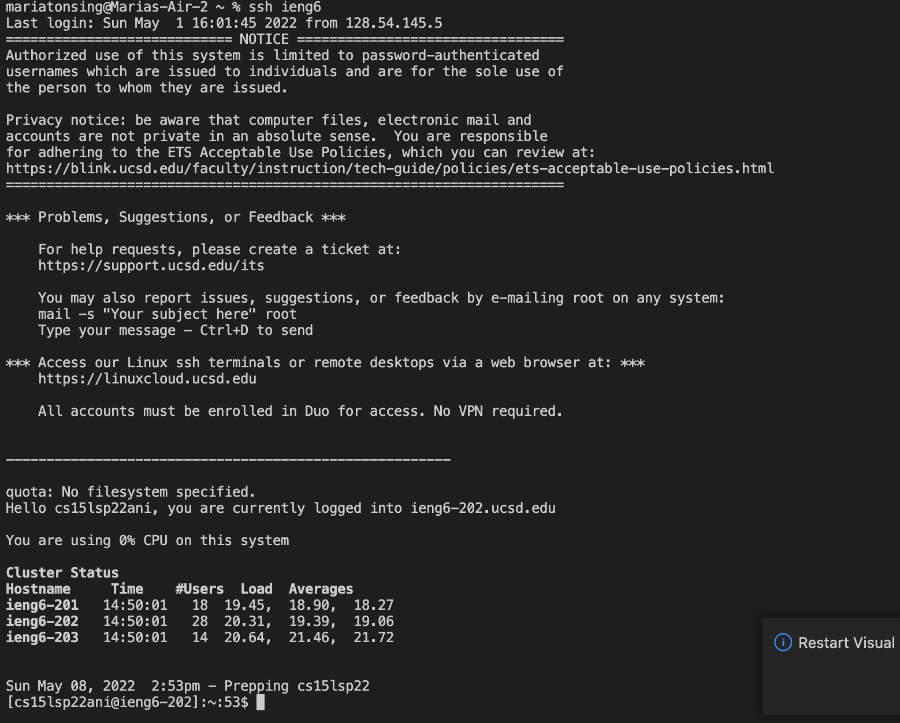

# Lab Report 3:implementing option 1-3 from *lab 5*
Now we will be implementing options 1-3 from lab five which include, streamlining ssh configuration, Setup github access from ieng6 and copying whole directories with scp -r.

## Streamlining ssh Configuartion
We will now show you how to log into your 
ieng6 account without having to insert 
your own password.
* We will first do so by typing in the terminal
`~/.ssh/config` and if it doesn't exist you
will need to create it.
* Then on your file call config you must paste
the following lines onto the file
* **Host ieng6 
    HostName ieng6.ucsd.edu
    User cs15lsp22zz (replace cs15lsp22zz with your own username)**
* Now once you have edit the file you should now be able to
type in the terminal `ssh ieng6`
* Here is an image of how it will look like if everything is
implemented correctly. 

## Setup GitHub Access from ieng6

## Copy whole directories with scp -r

