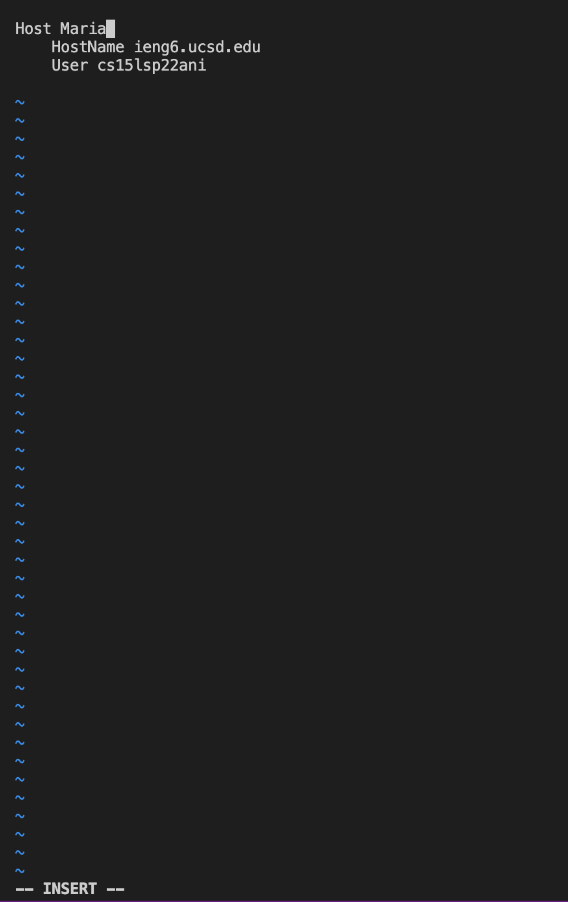

# Lab Report 3:implementing option 1-3 from *lab 5*
Now we will be implementing options 1-3 from lab five which include, streamlining ssh configuration, Setup github access from ieng6 and copying whole directories with scp -r.

## Streamlining ssh Configuartion
We will now show you how to log into your 
ieng6 account without having to insert 
your own password.
* We will first do so by typing in the terminal
`~/.ssh/config` and if you cannot open it becuase it doesn't exist you
will need to create it.
* Then on your file call config you must paste
the following lines onto the file, see first screenshot to see the format that which it should be indented.
* **Host ieng6 
    HostName ieng6.ucsd.edu
    User cs15lsp22zz (replace cs15lsp22zz with your own username)**
* In order to edit the file you must type on the terminal `vim config` which will then make the terminal look like the image below, where you can now edit it. In my case I changed my host to be now Maria. Once you have paste the lines above and finish editing the file to escape you will need to enter `esc` and then enter `:wq`. This will then save the changes made into config. 
* Here is an image of how I was able to open config and edited my file config.

* Below is an image of editing the config and choosing my alias to be Maria, as it was ieng6 before.

* Now once you have edit the file you should now be able to
type in the terminal `ssh ieng6` or if you have chosan another alias like me I will need to type `ssh Maria`.
* Here is an image of how it will look like if everything is
implemented correctly. 

* Next we will show an scp copying a file to our account using the alias we have chosen which for me will be Maria. So first make to sure exit your ieng6 account. Since we have now streamline our ssh configuartion we only need now to type,
`scp practice.java Maria:~/` (replace practice.java with file you want to copy) such that if we want to make sure we have copy to our account we can enter `ssh Maria` to log back into our account then `ls` which we will then see our file in this
case practice.java was succesffuly copied over to our account.
* Below is an image demonstrating this

## Setup GitHub Access from ieng6
Now we will show you how setup GitHub access
from ieng6
* We can see that if we make a edit on our file this case Markdownparse.java such as trying to 
do add,commit,push the do enter `git status` we will get an error because we need to be able to use a token-based mechanism such as ssh. To fix this issue we will create both a public and private key. 
* One can create a public simply on github which is was I did by pressing settings then ssh and GPG keys where I made my private key, report3key
* here is an image of my public key

* Likewise I created a private key. Below is an image of how I created my private and public key and where it is stored in my account. To create this key I enter `ssh-keygen` and then press enter several times until we are given the keys random art image. We can see on the last line that id_rsa is my private key and id_rsa.pub my public key location.

* Below is an image a part of my public key.

* Once we have our private key and public key created we will now make change to our markdownparse file and push to GitHub from our ieng6 account. Below is an image of me running git commands to commit and push a change to Github while being logged into my ieng6 account. For instance I change the current directory to markdown-parser.And the edit I make is creating a new file called a.md, then I enter the git commands, first `git add .` then `git commit -m "new file"` , then I am able to push by entering `git push` . As image below shows we are successfully able to do this. 

* As we can see we get no errors this time.
* Here is a link to for the resulting commit,
[Link to resulting commit](https://github.com/mtonsing/markdown-parser/commit/291862536fd07157aa4782a13a47b3b42fd0c661)
## Copy whole directories with scp -r
Now we will show you how to copy meaning copying the directory and all files that fall within a directory and further on. 
* to simply copy a certain directory you must type into your
remote server `scp -r . cs15lsp22@ieng6.ucsd.edu:~/markdown-parse`. Thus in this case we are copying the
directory markdown-parse onto the remote server if it
had not already existed as well copying all of what can 
be found of this given directory. Thus once this has been 
done we can log into the server and be able to see all of our files there in the specified directory which in this case is 
markdown-parse. 
* here is an image of succesfully copying whole markdown-parse directory to specific ieng6 account.

