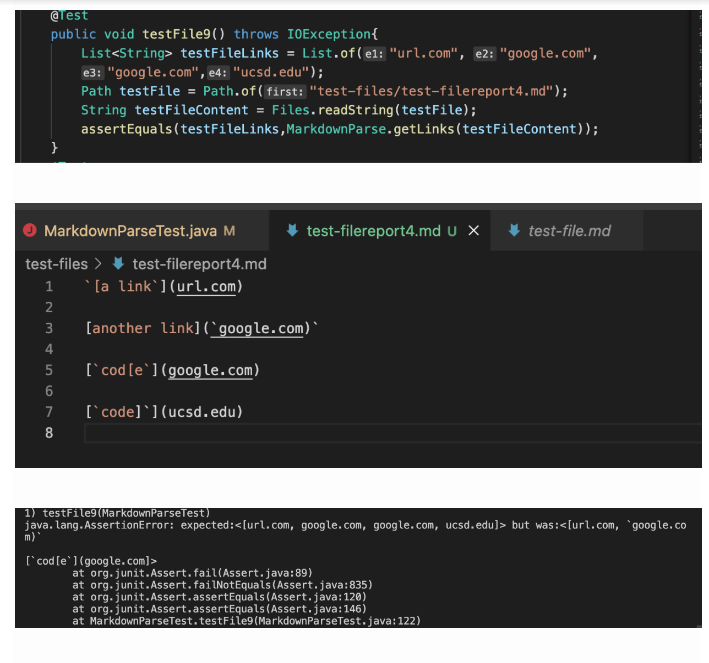
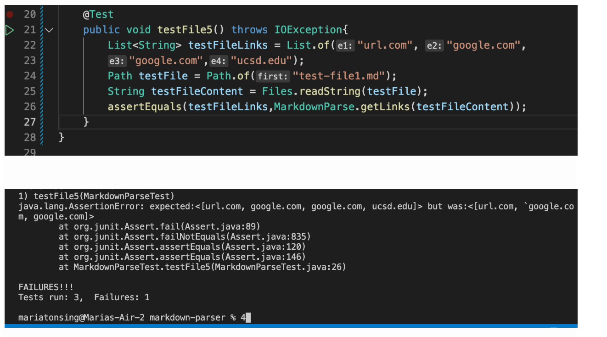
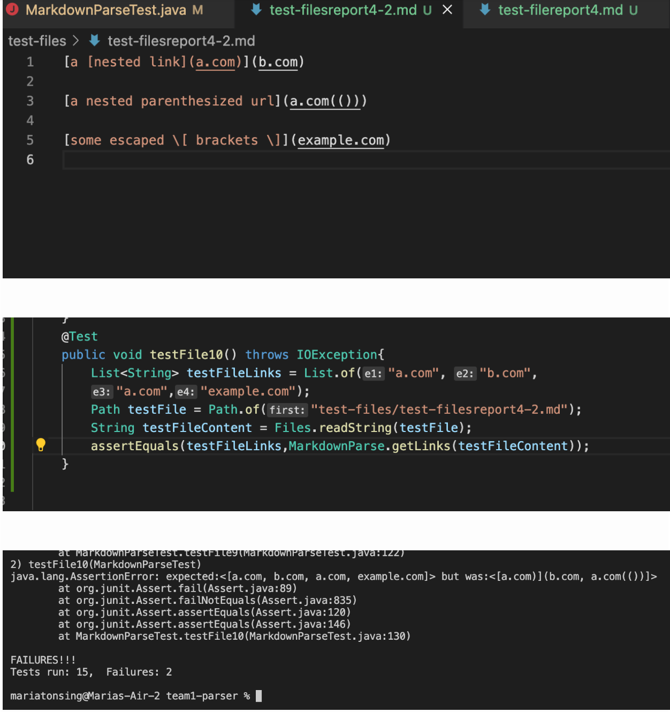
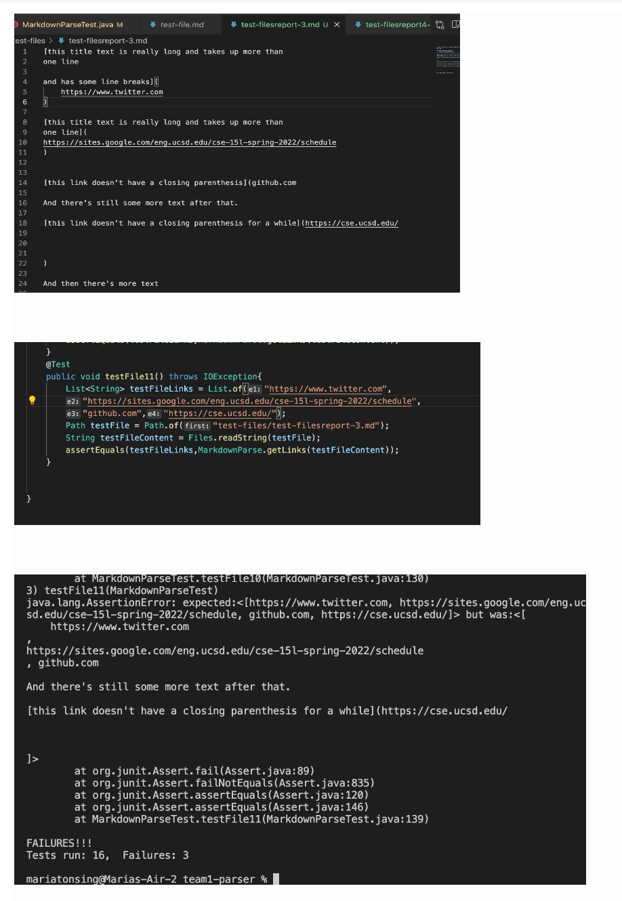
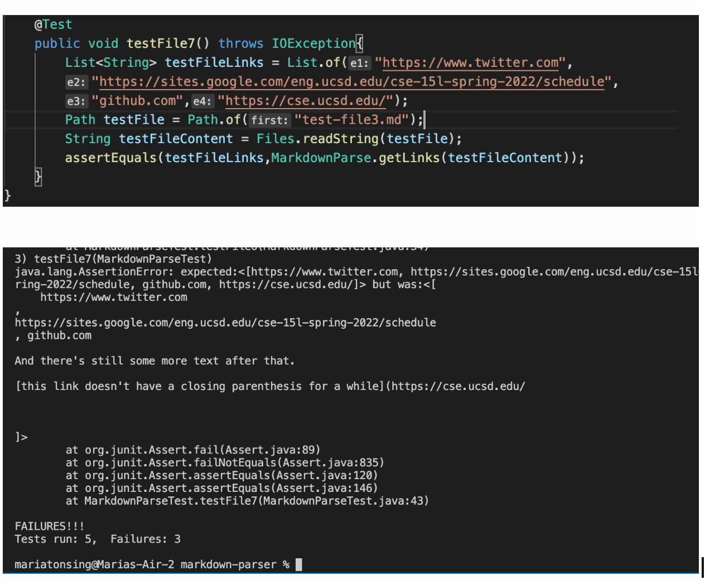

# Lab Report 4:*Testing three snippets* on my own markdown-parse and on the markdown-parse I reviewed on lab 7
## Testing 
* In order to test all my new test I inputed into
my terminal `javac -cp .:lib/junit-4.13.2.jar:lib/hamcrest-core-1.3.jar MarkdownParseTest.java` and after pressing enter I type in the terminal, 
`java -cp .:lib/junit-4.13.2.jar:lib/hamcrest-core-1.3.jar org.junit.runner.JUnitCore MarkdownParseTest`
## Link to markdown-repository
* Here is a link to my own markdown-parse repository, [Link](https://github.com/mtonsing/markdown-parser)
* Here is a link to the markdown-parse repository that i reviewed, [Link](https://github.com/thanhnhanlam/markdown-parser) 
## Test Snippet One
* Testing snippet One on markdown-parse I reviewed on lab 7. Below is a photo of first of how I created the test in my markdown parse test file. The second image is the file componenets. And laslty the last image shows if it fails or pass as it can be seen our test failed in this case. 

* Testing snippet One on my own markdown-parse.
Below is image of testing snippet one to my own markdown-parse file. I do not included what the file we are testing contains becuase its identical to the image that was previously shown,

* After testing I feel that there will need to be a code change in order to fix the error a code that is less than 10 lines will be do able I feel.
## Test Snippet Two
Testing snippet two on markdown-parse I reviewed on lab 7.Similary follow same procedure to now test snippet two as it can be seen our test fails. 

* Testing snippet two on my own markdown-parse.The image below shows how I created the test in my markdowntest file and what part my test fails as it can be seen this test fails.

* After testing I feel that there will need to be a code change in order to fix the error a code that is less than 10 lines will be do able I feel.
## Test Snippet Three
Testing snippet three on markdown-parse I reviewed on lab 7.Below is an image of how i was able to test snippet three on the markdown parse that i reviewed in lab 7. As we can see the test fails. 

* Testing snippet three on my own markdown-parse.
Similar process to the past steps we see that our test fails after recreated my test in my parsetest-file in order to save gas. 

* After testing I feel that there will need to be a code change in order to fix the error a code that is less than 10 lines will be do able I feel.