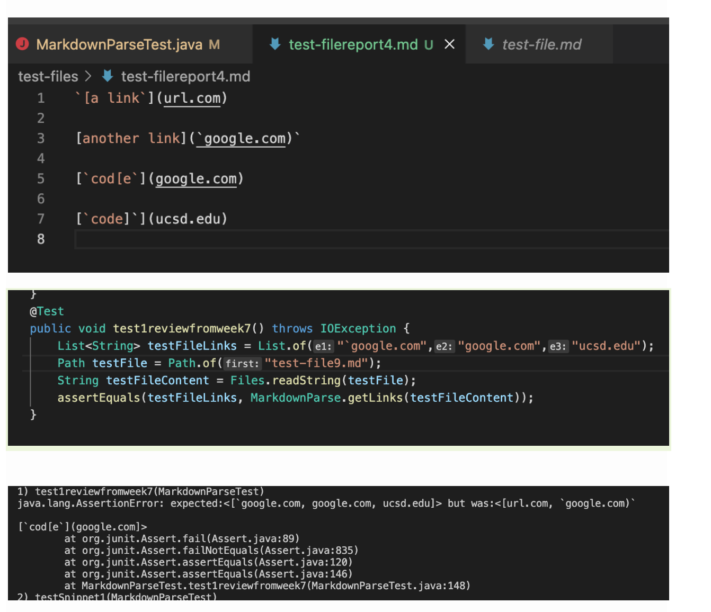
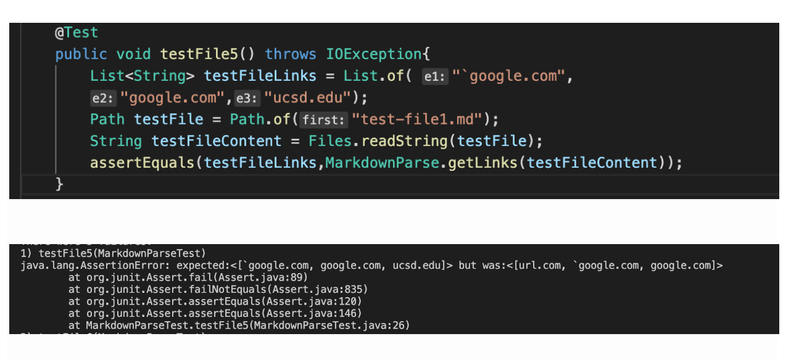
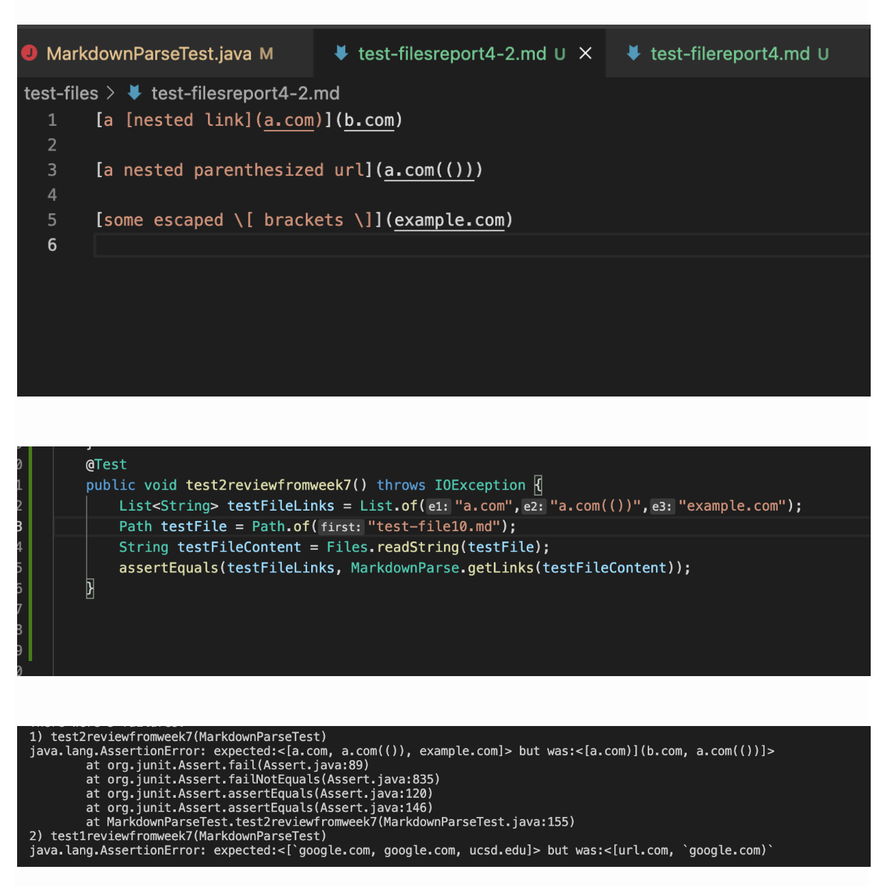
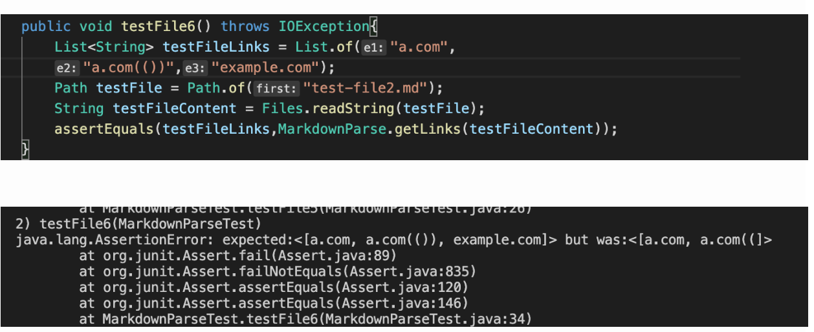
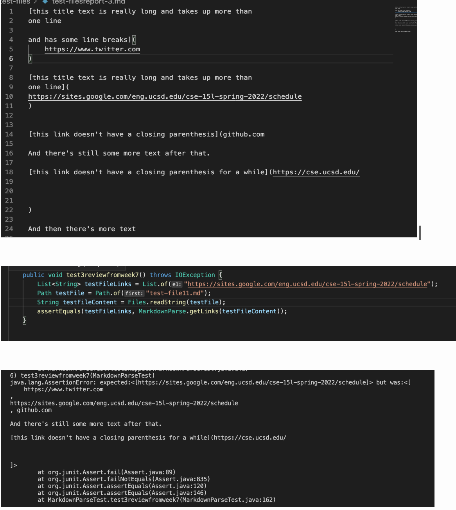
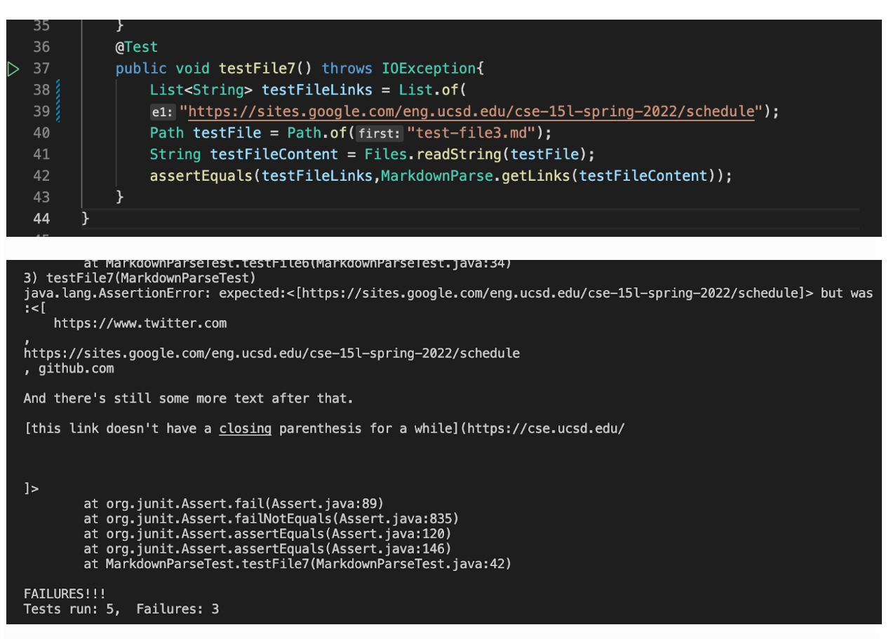

# Lab Report 4:*Testing three snippets* on my own markdown-parse and on the markdown-parse I reviewed on lab 7
## Testing 
* In order to test all my new test I inputed into
my terminal `javac -cp .:lib/junit-4.13.2.jar:lib/hamcrest-core-1.3.jar MarkdownParseTest.java` and after pressing enter I type in the terminal, 
`java -cp .:lib/junit-4.13.2.jar:lib/hamcrest-core-1.3.jar org.junit.runner.JUnitCore MarkdownParseTest`
## Expected Output
* I have decided wht each test should produce by using [the CommonMark Demo site](https://spec.commonmark.org/dingus/).
By using this site I got that the expected output should be,
* Snippet one- `google.com,google.com,ucsd.edu
* Snippet two- a.com,a.com9(()),example.com
* Snippet three- https://sites.google.com/eng.ucsd.edu/cse-15l-spring-2022/schedule

## Link to markdown-repository
* Here is a link to my own markdown-parse repository, [Link](https://github.com/mtonsing/markdown-parser)
* Here is a link to the markdown-parse repository that I reviewed, [Link](https://github.com/thanhnhanlam/markdown-parser) 
## Test Snippet One
* Testing snippet One on markdown-parse I reviewed on lab 7. Below is a photo of first of how I created the test file in their markdown parse. I did the exact same test file in my own markdown-parse but with a different file name. The second image shows how I created the test in their MarkdownParseTet.java. And lastly the last image shows if it fails or pass as it can be seen our test failed in this case. The following test snippets follow same procedure.

* Testing Snippet One on my own markdown-parse.
Below is image of testing snippet one to my own markdown-parse file. I do not included image of what the file we are testing contains becuase its identical to the image that was previously shown. As is seen our test fails. 

* After testing I feel that there will need to be a code change in order to fix the error, a code that is less than 10 lines will be do able to fix this error I feel. The code change for this specific test I feel would be, not letting back ticks effect the lines of code that which we want to run since we see from the results our code stops after the second back tick that appears after the closing parenthesis stops our code thinking that our code is done. Thus feel to fix it we just need less than 10 lines to fix. Thus since I aim to fix inline code with backticks I feel this code fix will not only fix snippet one but also all cases related to inline code with backticks.
## Test Snippet Two
Testing snippet two on markdown-parse I reviewed on lab 7. Similary follow same procedure to now test snippet two as it can be seen our test fails. 

* Testing snippet two on my own markdown-parse.The image below shows how I created the test in my markdown-parser test file and what part my test fails as it can be seen this test fails as well.

* As we have failed the test I feel that there will need to be a code change in order to fix the error a code that is less than 10 lines will be do able I feel. From our results it's clear that our expected results is not similar to our actual results.This specific code that will fix this error I feel will be being able to count when we have an open parenthesis and match it to a close parenthesis such as never first printing a close parenthesis first as seen from our results we ended up printing a.com) when it should of been just a.com.Thus a loop to match open and close parenthesis together and printing the first link wihtin this set of parenthesis will help us get our desired results,for not only snippet two but also for cases that nest parentheses,brackets and escaped brackets.
## Test Snippet Three
Testing snippet three on markdown-parse I reviewed on lab 7.Below is an image of how i was able to test snippet three on the markdown parse that i reviewed in lab 7. As we can see the test fails. 

* Testing snippet three on my own markdown-parse.
Similar process to the past steps we see that our test fails after creating my test in my MarkdownParseTest.java. 

* After testing I feel that there will need to be a code change in order to fix the error a code that is more than 10 lines. The specific code that would fix this error I feel will be a take longer lines to see which index to print such that removing the unnecessary spaces from our print statements which can most likely be done as a for loop checking if it equals an empty space to move on to next index,and if there is line breaks to not print the following link as we can see from our result it only print the second link because while the text was long and took more than one line it did not have any line breaks.The reason why I feel we must have more than 10 lines possibly is because we also must take into consideration the case where the link doesn't have a closing parenthesis thus should not be printed. Which can also be done making sure to print when we have an open and close parenthesis set. I feel this code change will help fix not only this test snippet but also the cases that have newlines in brackets and parentheses. 