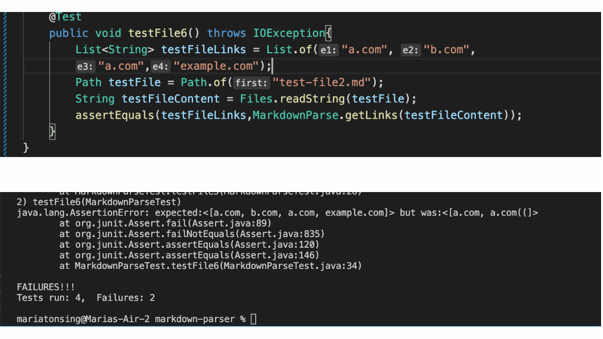

# Lab Report 4:*Testing three snippets* on my own markdown-parse and on the markdown-parse I reviewed on lab 7
## Test Snippet One
* Testing snippet One on markdown-parse I reviewed on lab 7.

* Testing snippet One on my own markdown-parse.

## Test Snippet Two
Testing snippet two on markdown-parse I reviewed on lab 7.

* Testing snippet two on my own markdown-parse.

## Test Snippet Three
Testing snippet three on markdown-parse I reviewed on lab 7.

* Testing snippet three on my own markdown-parse.
