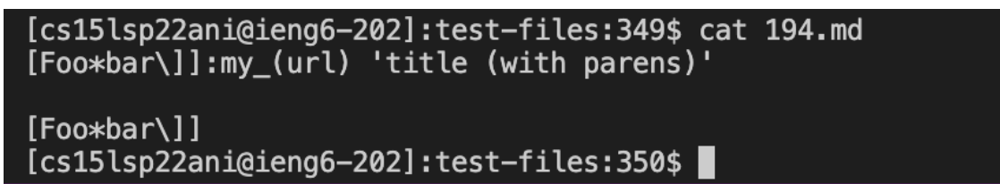

# Lab Report 5:Using two test where my implementation had different answers than the implementation provided in *lab 9*
## How I was able to find the test with different results
* By implementing what was done in Lab 9, I was able to find the test
with different results. I did this through the process of using vimdiff on the results of running a bash for loop.And then scrolling through to see which test contains different results.To specify with more details I first I created two result.txt which contains the output of each test file as done in lab 9. By first editing the provided file, scipt.sh that is provided to also print out the name of each file before it's output by adding the line `echo "$file"`. I was able to create result.txt by typing the following in the command line, `bash script.sh > results.txt`, which will save all output of each file to one file, results.txt. I then followed the same steps to get a results.txt for my own markdown-parse. Once I had two results.txt files I then opend it using vimdriff by typing the following command, `vimdiff markdown-parser/results.txt cse15lsp22-markdown-parser/results.txt` which led me to the following image below. Here the left side demonstrate my for a specific test file output for my own markdown-parse and the right side demonstrate the output for the same test file of the given markdown-file provided in lab 9. I can then scroll to I see a pruple line which means the output for the same test file is differs between mine and the markdown-parser provided in lab 9.And to exit this screen I do so by using escape + "`:q`" twice.

## Link to test files with different results
* Link to test file 194
[Link to test file 194](https://github.com/nidhidhamnani/markdown-parser/blob/main/test-files/194.md)
* Link to test file 201
[Link to test file 201](https://github.com/nidhidhamnani/markdown-parser/blob/main/test-files/201.md)
## Test File 194
* Below is an image of the actual test file

* Which implementation is correct: By using [commonmark](https://spec.commonmark.org/dingus/) I was able to see that the correct implementation was neither since the expected output was *title (with parens)*. Since we can see my actual output was an error messages which showed that there is no valid link while the the markdownparser provided in lab 9 was *[url]* which is also wrong. 
* Both actual outputs and expected output:
As was mention previously we see that the expected and actual output are not at all the same here is the image of actual output for test file 194 for mine and their implementation. 

* The bug/The code that should be fix: Since both cases are wrong
since neither is printing the correct output we will choose my code to fix. In my case my code think there is not valid link which is not the case thus one of our cases where we check if the link is a valid link is incorrect. 
## Test File 201
* Below is an image of the actual test file 

* Which implementation is correct:
For this test file it's clear that the correct implementation is, my implementation of markdown-parser, where the actual output and the expected output for test file 201 is,an empty list since no link is valid.In this case the given implementation in lab output was incorrect since its output was, *[baz]*.
* Both actual outputs and expected output:
As mention before we see that my actual output is similar to the expected output, while the give implementation of lab 9 output is incorrect. Below is an image of the actual output for both implementation.

* The bug/The code that should be fix:
Thus in this case my code is correct and we must fix the code from the given implementation of lab 9. As we need to print an empty list that does not include baz. Thus in this case they think that the correct link is baz and to fix this we need to make sure....